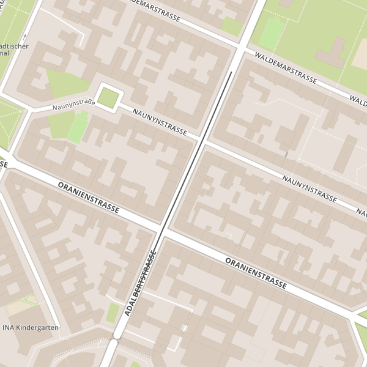

# Mapmatching


If you've collected data with a GPS unit, either through a fitness device, mobile phone or dedicated GPS unit,
chances are good that it doesn't line up perfectly with other data. The mapmatching service
allows you to correct the GPS traces against a common base map, OSM.

You might need to [preprocess the data](https://www.mapbox.com/developers/api/map-matching/#Preprocessing.traces)
in order to get GeoJSON linestring features.

```json
{
  "type": "Feature",
  "properties": {
    "coordTimes": [
      "2015-04-21T06:00:00Z",
      "2015-04-21T06:00:05Z",
      "2015-04-21T06:00:10Z",
      "2015-04-21T06:00:15Z",
      "2015-04-21T06:00:20Z"
    ]
    },
  "geometry": {
    "type": "LineString",
    "coordinates": [
      [ 13.418946862220764, 52.50055852688439 ],
      [ 13.419011235237122, 52.50113000479732 ],
      [ 13.419756889343262, 52.50171780290061 ],
      [ 13.419885635375975, 52.50237416816131 ],
      [ 13.420631289482117, 52.50294888790448 ]
    ]
  }
}
```

Once you've got that, you can use the CLI

```
$ mapbox mapmatching trace.geojson > newtrace.geojson
```

And visualize the output with a staticmap.

The original trace

```
$ cat trace.geojson | mapbox staticmap --features - mapbox.streets oldtrace.png
```


And the corrected 
```
$ cat newtrace.geojson | mapbox staticmap --features - mapbox.streets newtrace.png
```


